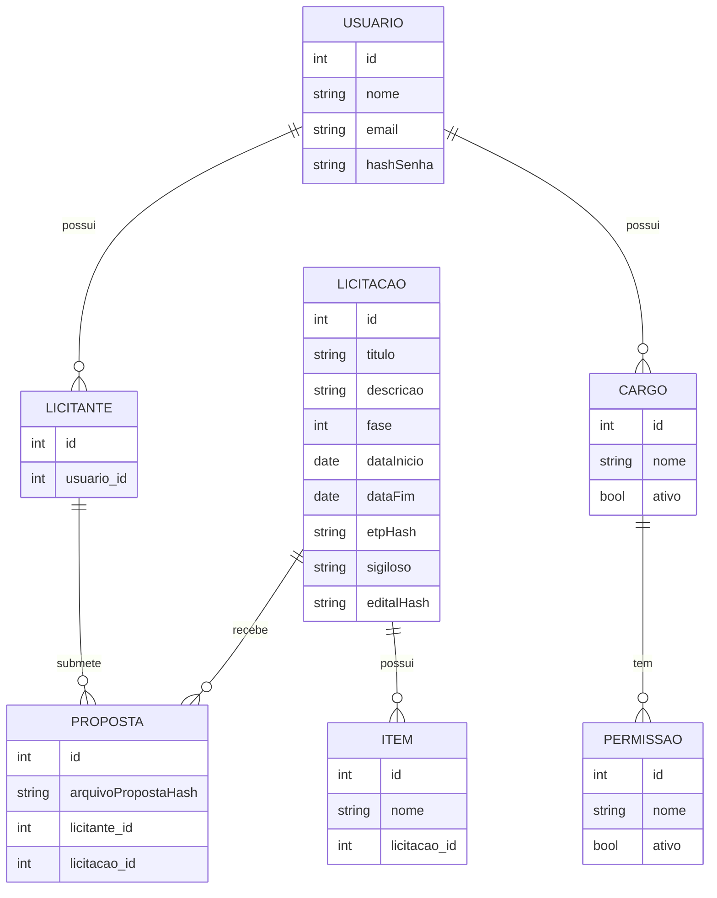
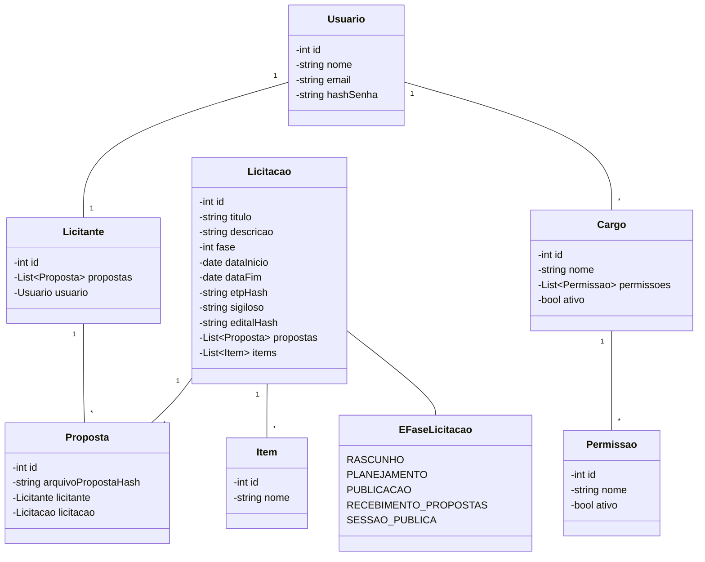

```mermaid
sequenceDiagram
    Frontend->>+Backend: Requisição no endpoint de consulta
    Backend-->>+Blockchain: Busca o bloco com o hash da licitação
    Blockchain-->>-Backend: Retorna dados do bloco
    Backend->>+DB: Busca os dados de licitante e dados dos candidatos 
    DB->>-Backend: Retorna os solicitados dados 
    Backend-->>+IPFS: Busca arquivos da licitação
    IPFS-->>-Backend: Retorna hashes dos arquivos
    Backend->>-Frontend: Resposta do endpoint
```

```mermaid
sequenceDiagram
    Frontend->>+Backend: Requisição no endpoint de criação
    Backend->>Backend: Verifica os dados
    Backend-->>+IPFS: Adiciona arquivos
    IPFS-->>-Backend: Retorna hashes dos arquivos
    Backend->>+DB: Cadastra dados
    DB->>-Backend: Retorna dados cadastrados
    Backend-->>+Blockchain: Registra a licitação
    Blockchain-->>-Backend: Retorna dados do bloco
    Backend->>-Frontend: Requisição no endpoint de criação
```

```mermaid
sequenceDiagram
    participant Frontend
    participant Backend
    participant IPFS
    participant Blockchain
    
    Frontend->>+Backend: Requisição de edição da licitação
    Backend->>+IPFS: Atualiza documentos
    IPFS-->>-Backend: Confirmação da atualização
    Backend->>+Blockchain: Registra transação de mudança de estado
    Blockchain-->>-Backend: Confirmação da transação
    Backend-->>-Frontend: Confirmação da edição
```

## Artefatos de Software

### Casos de uso

### Diagrama de Entidade Relacional

### Diagrama de Classes

### Arquitetura

```mermaid
graph TD
    subgraph Frontend
    
        AR[Frontend]
    end

    subgraph Backend
    B(C#/.Net Core)
    CA[Controller] --> |Lógica de Aplicação| S[Service]
    BI[Infrastructure]
    R[Repository]
    end

    subgraph Blockchain
    SC[Smart Contracts]
    BC[Hyperleger Besu]
    end

    subgraph Armazenamento
    D[(IPFS)]
    E[(PostgreSQL)]
    end

    subgraph Observabilidade
        P[Prometheus] --> G[Grafana]
    end


    AR -->|Requisições HTTP| CA
    S --> BI -->|Gerenciamento de Dados| R
    BI -->|Persiste e busca dados| SC
    SC -->|Interage com| BC
    BI --> |Exporta métricas| P
    BC -->|Exporta métricas|P
    R -->|Leitura/Escrita| E
    BI -->|Armazena Arquivos| D
```

### DIAGRAMAS DE SEQUENCIA

#### BUSCA DE LICITAﾃﾃグ

#### CADASTRO DE LICITAﾃﾃグ

#### EDIﾃﾃグ DE LICITAﾃﾃグ

